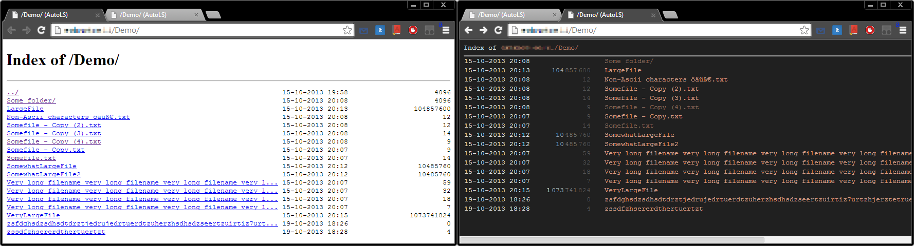

Nginx AutoLS Module
===================


***
***WARNING***: This project is still in the early stages and hasn't had much testing yet.
***

What is AutoLS
--------------
AutoLS aims to be a more customizable variant of the built-in [AutoIndex Module](http://wiki.codemongers.com/NginxHttpAutoindexModule),
which provides simple directory listings. To achieve this, the output is generated by a **user definable template**, which can be **set per location**.

Once a template is written, it can be further manipulated through the nginx config, which allows you to do a variety of things:
* **Fully user definable page look**
* **Add CSS styles or JS code**
* **Add your own header and footer**
* All of the above but change parts of it via nginx config with the same template

You can also define rules which **filter out files/directories** which you don't want to list (e.g. protected folders or files starting with '.').

The default configuration of AutoLS will try mimic AutioIndex's layout but is a bit more stable when handling unicode, so it will handle most latin characters properly.
You will still see alignment issues when displaying complex characters (i.e. combining characters or asian characters which have different sizes)  
If this is an issue, use/build a template which does not rely on monospace font (i.e. with html tables).

Directives
--------------
***autols***  
**Syntax**: `autols (on | off)`  
**Default**: `autols off`  
**Context**: http, server, location  
Enables autols directory listing.  

***autols_template_path***  
**Syntax**: `autols_template_path "/Path/To/Template/File"`  
**Default**: `autols_template_path ""`  
**Context**: http, server, location  
Sets the template to use. If empty, the default template is used.  

***autols_sections***  
**Syntax**: `autols_sections "Section1" ["Section2"] [...]`  
**Default**: `autols_sections ""`  
**Context**: http, server, location  
Sets the sections to include for templating.  
(Statements are concatenated)  

***autols_variables***  
**Syntax**: `autols_variables "Key1=Var1" ["Key2=Var2"] [...]`  
**Default**: `autols_variables ""`  
**Context**: http, server, location  
Sets the variables to be used for templating.  
(Statements are concatenated)  

***autols_ignores***  
**Syntax**: `autols_ignores "Entry1" ["Entry2"] [...]`  
**Default**: `autols_ignores ""`  
**Context**: http, server, location  
Sets the entries which will not be shown in the directory listing. If nginx is compiled with regex support each entry is treated as a regex pattern and is matched against the request uri combined with the filename. With no regex support, an exact match is performed.
(Statements are concatenated)  

***autols_local_time***  
**Syntax**: `autols_local_time (on | off)`  
**Default**: `autols_local_time off`  
**Context**: http, server, location  
Enables showing file times as local time. Default is "off" (GMT time).  

***autols_print_debug***  
**Syntax**: `autols_print_debug (on | off)`  
**Default**: `autols_print_debug off`  
**Context**: http, server, location  
Print debug info. Enable only for debugging purposes!


Templating
----------
Templating is relatively simple. There are only two different 'statements':
 * **Sections**: `<!--{SectionName}-->Code in section<!--{/SectionName}-->`
  * Will be skipped if it is not defined in `autols_sections`
  * *EntryLoop* is a special section and will be repeated for every file/directory  
 * **Variables**: `<!--[VariableName?Attribute1=Value1&Attribute2]-->`
  * Variables are replaced by their value and can be formatted by attributes (order matters)
  * Variables can be defined in `autols_variables`, there are also some predefined variables


####Predefined Variables
***ReplyCharSet***  
**Context**: Anywhere  
The character set to use. By default `UTF-8` (Changeable by config).  

***RequestUri***  
**Context**: Anywhere  
The request uri.  

***EntryIsDirectory***  
**Context**: EntryLoop  
Is "1" iif the entry is a directory otherwise "0".  

***EntryModifiedOn***  
**Context**: EntryLoop  
The date when the file was last modified `dd-mm-jjjj hh:MM`.  

***EntrySize***  
**Context**: EntryLoop  
The filesize, empty for directories. *TODO*  

***EntryName***  
**Context**: EntryLoop  
The filename.  


####Attributes
***Format***  
**Syntax** `Format=PrintfSyntax`  
**Context**: All  
Formats the value with printf syntax for the format string.  

***Escape***  
**Syntax** `Escape=(UriComponent | Uri | Html)`  
**Context**: All  
Escapes the value with the method specified.  

***MaxLength***  
**Syntax** `MaxLength=10`  
**Context**: All  
Trims the string and appends "`...`" to length specified if necessary (ellipsis in count included).  

***AsLossyAscii***  
**Syntax** `AsLossyAscii=?`  
**Context**: Anywhere  
Performs a lossy conversion from Unicode to Ascii, replacing multibyte characters by the specified character.  

***Separator***  
**Syntax** `Separator=,`  
**Context**: EntryLoop  
Appends the specified separator after each produced entry, except for the last. 
 
***StartAt***  
**Syntax** `StartAt=40`  
**Context**: All inside EntryLoop  
Prepends spaces until the specified position is reached, relative to EntryLoop section start.  

***NoCount***  
**Syntax** `NoCount`  
**Context**: All inside EntryLoop  
Added value length is ignored by StartAt.  

***Utf8Count***  
**Syntax** `Utf8Count`  
**Context**: All inside EntryLoop  
Uses Utf8 length instead of Ascii length.  


Default Template
----------------
```
<!DOCTYPE html>
<html>
  <head>
    <meta charset="<!--[ReplyCharSet]-->">
    <title><!--[RequestUri]--> (AutoLS)</title><!--{JSVariable}-->
    <script type="text/javascript">
      var dirListing = [<!--{EntryLoop?Separator=,}-->
        {
          "isDirectory": <!--[EntryIsDirectory]-->,
          "modifiedOn": "<!--[EntryModifiedOn]-->",
          "size": <!--[EntrySize]-->,
          "name": "<!--[EntryName]-->"
        }<!--{/EntryLoop}-->
      ];
    </script><!--{/JSVariable}--><!--{JSSource}-->
    <script type="text/javascript" src="<!--[JSSource]-->"></script><!--{/JSSource}--><!--{CSSSource}-->
    <link rel="stylesheet" type="text/css" href="<!--[CSSSource]-->"><!--{/CSSSource}-->
    <!--[Head]-->
  </head>
  <body bgcolor="white"><!--{Body}-->
    <!--[Header]-->
    <h1>Index of <!--[RequestUri]--></h1>
    <hr>
    <pre><!--{EntryLoop}--><a href="<!--[EntryName?Escape=Uri&NoCount]-->"><!--[EntryName?MaxLength=66&Utf8Count]--></a><!--[EntryModifiedOn?StartAt=82]--> <!--[EntrySize?Format=%24s]-->
<!--{/EntryLoop}--></pre><!--{/Body}-->
    <!--[Footer]-->
  </body>
</html>
```

####User Defined Sections
Sections will only appear in the result if they are defined in `autols_sections`.  
***JSVariable***: Creates a global JS variable with the file/directory info  
***JSSource***: Create a JS source link section in the header. (Use *JSSource* variable to set the url)  
***CSSSource***: Create a CSS source link section in the header. (Use *CSSSource* variable to set the url)  
***Body***: Creates the html body  
 

####User Defined Variables
***Head***: Add custom code to html head  
***Header***: Custom html body header  
***JSSource***: JS Source url  
***CSSSource***: CSS Source url  
***Footer***: Custom html body footer  


Installation/Building
---------------------
* Clone this repository. Search for the config file in cloned repository and note path (without filename)
* Get nginx sources from http://hg.nginx.org/nginx, any 1.4.* version should do (1.5 seemed to work as well)
* Extract and enter folder and run `./Configure --add-module=DirectoryPathToConfigFile [some more settings]`
* After that was sucessful run `make install` (you probably need to prepend sudo for it to work)
 * For more information refer to [Building Nginx From Source](http://wiki.nginx.org/Install#Building_Nginx_From_Source)

**Tip**: You can use the `-V` argument on a deployed nginx to get the parameters it was configured with.
